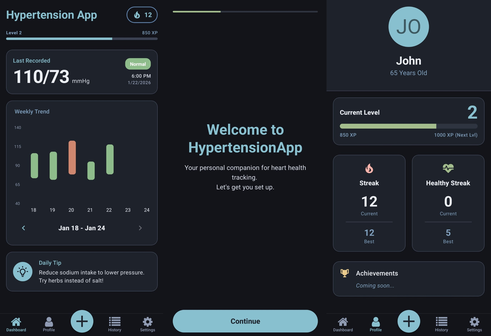

# HypertensionApp



A mobile application for tracking and managing hypertension (blood pressure) built with React Native and Expo. This app helps users log their blood pressure readings, visualize trends, and stay motivated with gamification features.

A demo can be downloaded from the releases tab here: [Releases](https://github.com/Zyelixify/HypertensionApp/releases/tag/DEMO)

## Features

* **Blood Pressure Tracking**: Log Systolic and Diastolic readings easily.
* **Health Connect Integration**: Syncs data with Android Health Connect (Read/Write support).
* **Visualizations**: View weekly trends to monitor your health over time.
* **Encouragement**: Daily tips and a streak system (with XP) to encourage consistent monitoring.
* **Notifications**: Reminders to log your readings.
* **Personalized Profile**: Manage your settings and biological data.

## Tech Stack

* **Framework**: [Expo](https://expo.dev/) (React Native)
* **Language**: TypeScript
* **Navigation**: [Expo Router](https://docs.expo.dev/router/introduction/)
* **UI Library**: [React Native Paper](https://callstack.github.io/react-native-paper/)
* **Charts**: react-native-gifted-charts / react-native-chart-kit
* **State Management**: React Query (TanStack Query) & React Context
* **Animations**: React Native Reanimated
* **Storage**: Async Storage & Health Connect

## Prerequisites

* [Node.js](https://nodejs.org/)
* [Android Studio](https://developer.android.com/studio) (for Android Emulator)
* Health Connect installed on the device/emulator (Required for Health Connect features).

> [!NOTE]
> Ensure "Health Connect" is installed and configured on your Android device/emulator. iOS is currently not supported as I could not develop for it without required hardware.

## Installation & Setup

1. **Clone the repository:**

    ```bash
    git clone https://github.com/Zyelixify/HypertensionApp.git
    cd HypertensionApp
    ```

2. **Install dependencies:**

    ```bash
    npm install
    # or
    yarn install
    ```

3. **Prebuild (Optional but recommended for native directories):**
    If you need to regenerate the `android/` folder:

    ```bash
    npx expo prebuild
    ```

## Running the App

### Android

This app relies heavily on **Health Connect**, so it must be run on an Android device.

Start the app:

```bash
npx expo run:android
```

## Project Structure

* `app/`: Application screens and routing (Expo Router).
* `components/`: Reusable UI components (Dashboard, Charts, etc.).
* `context/`: React Context providers (Theme, etc.).
* `hooks/`: Custom React hooks (Data fetching, Theme).
* `plugins/`: Expo Config Plugins (Health Connect configuration).
* `services/`: Business logic (Health Service, Notifications, Storage).
* `utils/`: Helper functions.

## Permissions

The app requires the following permissions to function correctly:

* `android.health.connect.HealthPermissions.READ_BLOOD_PRESSURE`
* `android.health.connect.HealthPermissions.WRITE_BLOOD_PRESSURE`
* Notification permissions.
